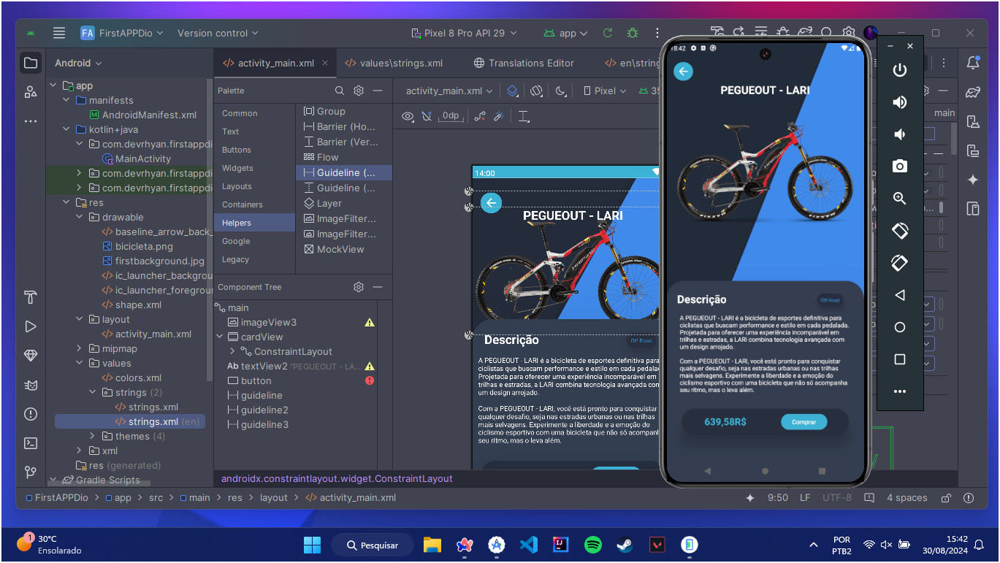

  
  <h1> Internalization App Coding Challenge </h1>

## Tecnologias Utilizadas

## Objetivo

Este projeto tem como objetivo criar uma interface conceitual para explorar o recurso de internacionalização no sistema Android. Com o uso de arquivos de recursos, como o strings.xml, o Android permite adaptar o aplicativo para diversos idiomas, facilitando a tradução e a personalização de acordo com o idioma desejado.

  

<h1 align="center">
   Developed by Rhyan Araujo Chaves @2024
</h1>

